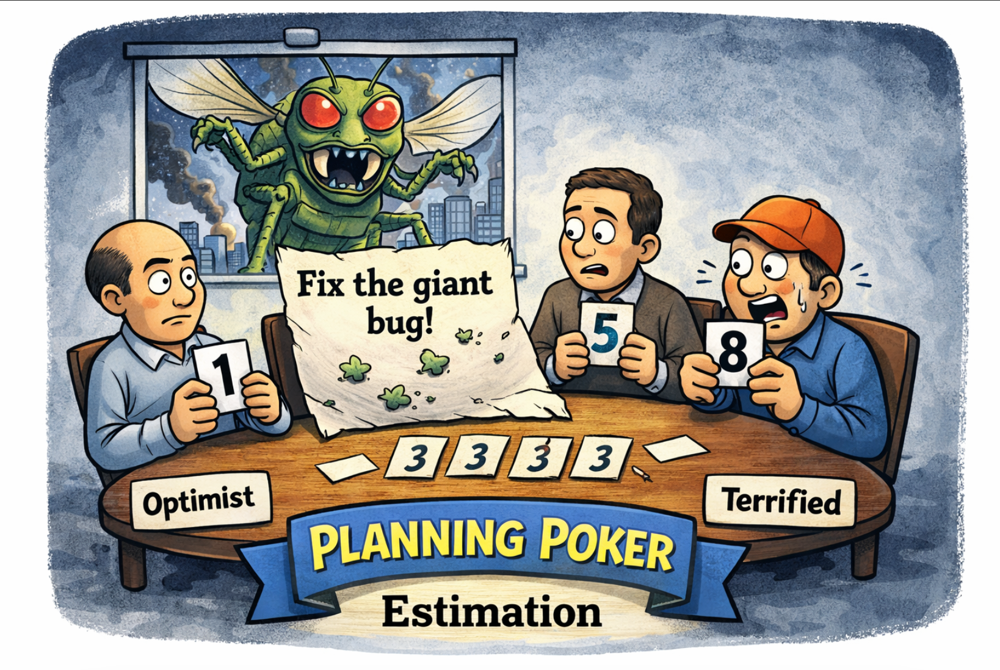
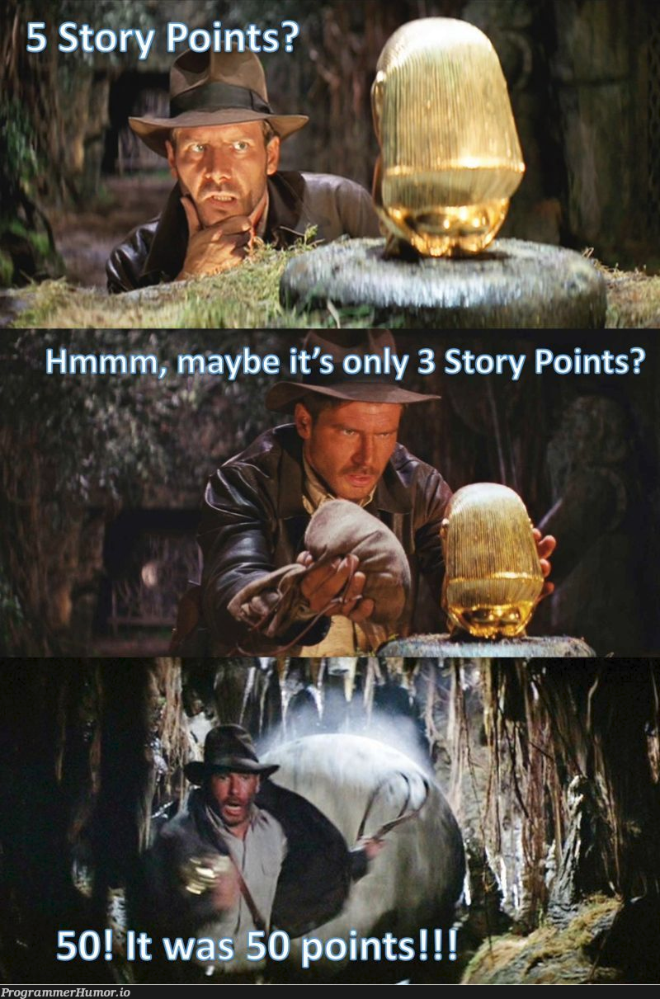

# Task Estimation In Scrum 

## Overview
Task estimation in Scrum is the process of predicting how much **effort** a piece of work will take. It is not about exact time, but about helping teams plan, prioritise and deliver work consistently and efficiently. 

In fast-moving teams with no standard approach, estimation becomes inconsistent which can often lead to:
	- missed deadlines
	- overloaded developers
	- poor quality software
Estimation acts as both a **process** and a metric, helping teams understand how work is done and how well it is preformed. 

## Why Task Estimation Matters
Without proper estimation:
	- Work becomes unpredictable
	- Sprints fail
	- Developers rush -> more bugs

From a Software Quality perspective:
	- Quality is not just "no defects" but delivering value to users
	- Poor planning -> rushed development = lower quality

### Key Benefits:
	- Helps teams **plan realistic** Scrums
	- Balances workload across developers
	- Improves **decision making metrics**
	- Identifies risks early
	- Enables continuous improvement
**Estimation is How Teams Answer...**
	- "How long will this take?"
	- "Can we finish this task in this sprint or over multiple?"
	- "Are we improving task completion, quality and efficiency over time?"

## How Estimation Works in Scrum 

### 1. Relative Estimation (Story Points)
Instead of estimating time, Scrum teams estimate **effort relative to other tasks**.

Example:
	- Small task -> 1 point
	- Medium task -> 3 points
	- Large task -> 8 points
Size focuses on:
	- Complexity
	- Effort
	- Uncertainty and possible roadblocks

### 2. Planning Poker (Most Common Method)
**Process:**
	1. Team reviews a task
	2. Each developer secretly chooses a number based on how much effort they think is required
	3. Numbers are all revealed at the same time
	4. Team discusses the difference
	5. A final estimate is agreed upon

	

**Why this works:**
	- Encourages discussion
	- Reduces bias or peer pressure
	- Uses whole team knowledge

### 3. Other Methods
	- T-shirt sizing (S,M,L)
	- Time-based estimation (less common)
	- Affinity estimation (grouping smaller tasks)
	
## Real World Challenges 
Estimation is often inaccurate in real teams. Common issues include:

### Unclear Requirements
- Tasks are not fully understood
- Leads to underestimation

### Optimism Bias
- Developers assume tasks will go smoothly 
- Leads to underestimation

### Lack of Experience
- Junior developers struggle to estimate tasks
- No historical data

### Inconsistent Process
- Everyone estimates differently
- No standard approach (Start-ups struggle in particular) 

### External Pressure
- Deadlines influence estimates
Estimates become "targets" instead of predictions

## Best Practices (What you as a team should aim for)

### Use Team-Based Estimation
- Always estimate as a group
- Combine different perspectives

### Break Work into Smaller Tasks
- Large tasks are harder to estimate
- Smaller tasks = more accurate 

### Use Historical Data (Metrics) 
- Track past sprint performance
- Use velocity (points completed per sprint) 

### Accept Uncertainty
- Estimates are not exact 
- Treat them as guidelines

### Review and Improve
- Compare estimated vs actual effort
- Adjust over time

### Standardise the Process
- Use consistent estimation methods
- Ensure all team members follow the same approach 

## Bad Practices (What you should avoid) 

### Estimating Alone 
- Removes team insight 
- Leads to inaccurate results

### Treating Estimates as Deadlines
- Creates pressure
- Encourages rushed, low-quality work

### Not Updating Estimates
-Work changes -> estimates must reflect that

### Ignoring Metrics
- Not learning from past sprints
- No improvement over time

### Estimating Large, Vague Tasks
- Leads to massive inaccuracies

## Link to Software Quality
Task estimation is directly connected to software quality.

### Poor Estimation Leads To: 
- Rushed development 
- Increased defects
- Burnout in teams

### Good Estimation Leads To:
- Better planning
- More testing time
- Higher quality software

*Quality depends on how work is done and measured*

## Key Takeaway
Task estimation is not about predicting the future perfectly - it is about creating a consistent process that improves planning, teamwork and software quality over time. If your team follows the guidelines on task estimation above and works on your process overtime, you should see a better quality of work produced, reduced burnout. Enabling your team to achieve small successes is the path to a strong and high achieving environment. 

	
